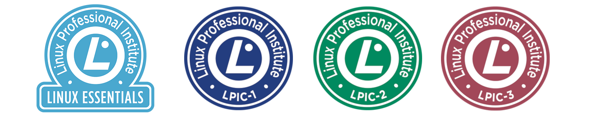

## About LPIC courses
Linux Professional Institute offers three different certification tracks. The core certification program, Linux Professional, contains three different levels addressing distinct aspects of Linux system administration.

### LEC Linux Professional Institute Linux Essentials
- What: Ability to use basic console line editor and demonstrate an understanding of processes, programs and components of the Linux Operating System.
- How: Pass the 010 exam; 40 multiple-choice questions in 60 minutes.
- Details: 1 exam, certification valid for lifetime. Price varies per region.

### LPIC-1 Certified Linux Administrator
- What: Ability to perform maintenance tasks with the command line, install and configure a computer running Linux and be able to configure basic networking.
- How: Pass 101 and 102 exams; each exam is 60 multiple-choice and fill-in-the-blank questions in 90 minutes.
- Details: 2 exams, certification valid for 5 years. Price varies per region.

### LPIC-2 Certified Linux Engineer
- What: Ability to administer small to medium–sized mixed networks.
- How: Pass 201 and 202 exams; each exam is 60 multiple-choice and fill-in-the-blank questions in 90 minutes. Must also have active LPIC-1 certification.
- Details: 2 exams, certification valid for 5 years. Price varies per region.

### LPIC-3 300: Linux Enterprise Professional Mixed Environment 
- What: Ability to integrate Linux services in an enterprise-wide mixed environment.
- How: Pass 300 exam; 60 multiple-choice and fill-in-the-blank questions in 90 minutes. Must also have active LPIC-2 certification.
- Details: 1 exam, certification valid for 5 years. Price varies per region.

### LPIC-3 303: Linux Enterprise Professional Security
- What: Ability to secure and harden Linux-based servers, services and networks enterprise-wide.
- How: Pass 303 exam; 60 multiple-choice and fill-in-the-blank questions in 90 minutes. Must also have active LPIC-2 certification.
- Details: 1 exam, certification valid for 5 years. Price varies per region.

### LPIC-3 304: Linux Enterprise Professional Virtualization and High Availability
- What: Ability to plan and implement enterprise-wide virtualization and high availability setups using Linux-based technologies.
- How: Pass 304 exam; 60 multiple-choice and fill-in-the-blank questions in 90 minutes. Must also have active LPIC-2 certification.
- Details: 1 exam, certification valid for 5 years. Price varies per region.
